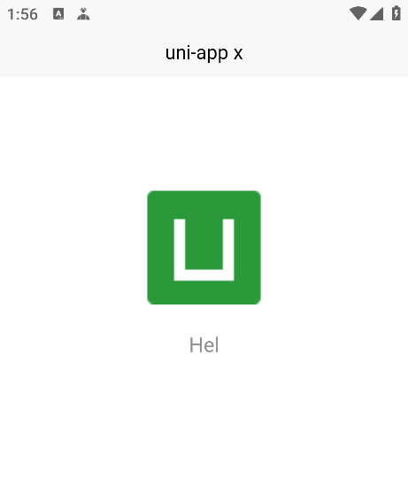

### 🟢🟢 点个关注不迷路🟢🟢  (≧◡≦) ♡
#### 🥺拜托了欧尼酱，阿里嘎多  Thank you  高马斯密达💖
### 👇👇⬇️⬇️

[](https://space.bilibili.com/3546827542497753) [](https://github.com/BrokenDreamTech) [](https://gitcode.com/BrokenDreamTech)

| 哔哩哔哩                                              | CSDN                                          | Github                                       | Gitcode                                       |
| ----------------------------------------------------- | --------------------------------------------- | -------------------------------------------- | --------------------------------------------- |
| [传送门](https://space.bilibili.com/3546827542497753) | [传送门](https://blog.csdn.net/2402_88197112) | [传送门](https://github.com/BrokenDreamTech) | [传送门](https://gitcode.com/BrokenDreamTech) |

> 一般CSDN会第一时间更新图文教程，后续会上传源码到Github和Gitcode上，最后再录视频教程发到哔哩哔哩，如果没时间的话可能不会录视频。
>

# Uni App X 安卓本地离线打包

#### 介绍：Uni App X 安卓本地离线打包喂饭教程


## 效果图片

#### 🟢温馨提示：如果图片无法加载请前往国内Gitcode镜像仓库




## 代码地址

🟢温馨提示：如果图片无法加载请前往国内Gitcode镜像仓库

Github：[https://github.com/BrokenDreamTech/UniAppxPack](https://github.com/BrokenDreamTech/UniAppxPack)

Gitcode：[https://gitcode.com/BrokenDreamTech/UniAppxPack](https://gitcode.com/BrokenDreamTech/UniAppxPack)


## 特性

- [x] Github Action一键打包,无需配置Android Studio配置
- [x] 压缩混淆配置,打包"Hello" apk大小：7.7MB
- [x] HBuilder X 4.85
- [x] HBuilder X 4.87


## 环境

HBuilder X 4.87

Android Studio 2025.2.2

## 教程

#### 视频教程

传送门：[https://www.bilibili.com/video/BV1yW6oBeEqy](https://www.bilibili.com/video/BV1yW6oBeEqy)

#### 图文教程

1. 使用HBuilder X打开你的uni-app x项目点击"工具栏"-"发行"-"App-Android/iOS-本地打包"-"生成本地App打包资源"

2. 因为"此项目"已有一个示例uni-app x，所以先把示例项目资源删除（不要乱删文件）：
   - 删除"此项目"的"app/src/main/assets/apps"文件夹下的所有
   - 删除"此项目"的"app/src/main/java"文件夹下的："index.kt"文件和"pages"文件夹
   
3. 将生成的"__ UNI __XXXXXX"文件夹复制到"此项目"的"app/src/main/assets/apps"文件夹下

4. 将生成的"uniappx/app-android/src"文件夹下的所有东西复制粘贴到"此项目"的"app/src/main/java"文件夹下

5. 使用Android Studio打开"此项目",直接打包即可。

   > 打包apk，在"此项目"的根目录打开命令行，执行：
   >
   > ```
   > gradlew assembleRelease
   > ```

## 一键打包	(不建议使用此方案,有构建时长限制,推荐自己按教程在本地打包)

1. 下载或fork此项目,将仓库设置为私有(如果你不想公开你的项目)，按照教程将uni-app x资源替换为自己的
2. 将项目推送到Githab上，点击"Actions"-"Build Release",等待构建完成
3. 构建完成后进入详情页,点击下载产物,下载后需解压


## 鸣谢

[https://doc.dcloud.net.cn/uni-app-x/native/download/android.html](https://doc.dcloud.net.cn/uni-app-x/native/download/android.html)

[https://doc.dcloud.net.cn/uni-app-x/native/use/android.html](https://doc.dcloud.net.cn/uni-app-x/native/use/android.html)

## 📄 License

#### [Apache License 2.0](./LICENSE.txt)