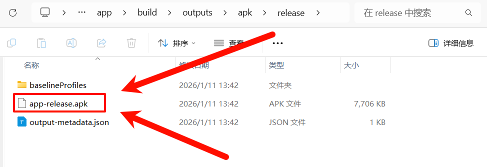

# Uni App X 安卓离线打包

#### 介绍：Uni App X 安卓离线打包喂饭教程

## 效果

## 环境

HBuilder X 4.85

Android Studio 2025.2.2

## 教程

1. uni-app x项目点击"工具栏"-"发行"-"App-Android/iOS-本地打包"-"生成本地App打包资源"
2. 将生成的"__ UNI __XXXXXX"文件夹复制到"此项目"的app/src/main/assets/apps文件夹下
3. 将生成的"uniappx/app-android/src"文件夹下的所有东西复制粘贴到"此项目"的app/src/main/java文件夹下

4. 使用Android Studio打开"此项目",直接打包即可。

## 鸣谢

https://doc.dcloud.net.cn/uni-app-x/native/download/android.html

https://doc.dcloud.net.cn/uni-app-x/native/use/android.html